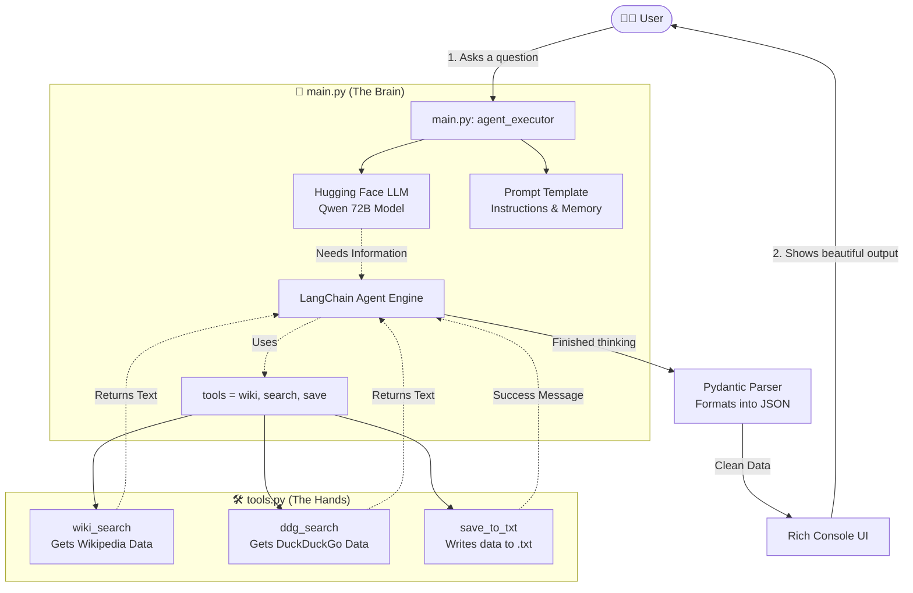

# 🧠 AI Agent Architecture & Execution Guide

Welcome! This guide is written in **simple, easy-to-read English** for beginners. It explains exactly how our AI Agent works, what each file does, and how the code flows from start to finish.

---

## 1. 🗺️ System Flow (Visual Mindmap)

Here is a visual map showing how all the pieces in the project connect together. 



---

## 2. 🔑 Keywords & What They Do

Here are the most important technical keywords used in the code and what their purpose is:

> [!NOTE]
> Think of **LangChain** as the glue that connects the AI brain to the real world (tools). 

*   **`ChatHuggingFace` / `HuggingFaceEndpoint`**: This is the "Brain". We use the Hugging Face API to connect to a powerful open-source model (like Qwen). It reads text, understands it, and decides what to do.
*   **`ChatPromptTemplate`**: This is the "Instruction Manual". It tells the AI: *"You are a research assistant. Follow these rules."*
*   **`{agent_scratchpad}`**: This is the AI's "Short-term Memory". When the AI uses a tool (like Wikipedia), it temporarily stores the reading material here so it can read it before giving you the final answer.
*   **`Tool`**: A bridge between Python code and the AI. AI models cannot browse the web by themselves. We write standard Python functions (like `ddg_search`) and wrap them in a `Tool`. The AI reads the tool's `description` to know *when* to use it.
*   **`AgentExecutor`**: The "Engine Loop". It handles the back-and-forth conversation between the AI and the Tools until the task is completely finished.
*   **`Pydantic (BaseModel)`**: The "Data Filter". AI naturally outputs a messy paragraph of text. Pydantic forces the AI to structure its output into clean, exact variables (like `topic`, `summary`, `sources`).

---

## 3. ⚙️ Step-by-Step Execution Flow

Let's imagine you type: **"Research Quantum Computing and save it."** Here is the exact lifecycle of how the code executes.

### Step 1: The Input
The program starts and asks for your input using the `Rich` UI library.
```python
# main.py
user_query = Prompt.ask("[bold green]What can I help you research?[/bold green]")
# You type: "Research Quantum Computing and save it."

# This line starts the entire Agent engine!
raw_response = agent_executor.invoke({"query": user_query}) 
```

### Step 2: The Agent Thinks (The Loop Begins)
The `agent_executor` sends your query to the Hugging Face LLM. 
The LLM reads your prompt instructions and realizes: *"I don't know enough about Quantum Computing. But I see a tool called `wikipedia`. I should use it!"*

### Step 3: Executing the Tool (The Hands)
LangChain automatically pauses the LLM and runs your Python function in `tools.py`.
```python
# tools.py
def wiki_search(query: str) -> str:
    # It searches Wikipedia for "Quantum Computing" and returns 5 sentences.
    return wikipedia.summary(query, sentences=5)
```

### Step 4: Storing in Memory
The 5 sentences from Wikipedia are injected into the `{agent_scratchpad}` memory variable. 
The LLM reads this memory and thinks: *"Okay, I have the data. But the user also asked me to save it. I must use the `save_text_to_file` tool."*
It runs the save tool, creating a `.txt` file on your computer.

### Step 5: Structuring the Output
The LLM realizes the task is fully complete. Now, it must follow the `Pydantic` rules. It generates a raw JSON response.
```python
# main.py
class ResearchResponse(BaseModel):
    topic: str
    summary: str
    sources: list[str]
    tools_used: list[str]

# We parse the AI's raw text into a clean Python Object
structured_response = parser.parse(output_text)
```

### Step 6: Beautiful Display
Finally, we take the clean data (like `structured_response.summary`) and print it to your terminal inside a beautifully colored Markdown box.
```python
console.print(Panel(
    Markdown(markdown_content), 
    title="[bold cyan]Research Complete[/bold cyan]"
))
```

And that is exactly how your AI Agent operates from start to finish! 🚀
